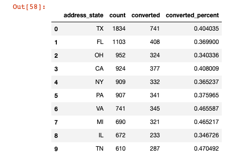

# Parachute Health Take Home Assessment 

### Navigation
- Please find the Jupyter Notebook `parachute_assessment.ipynb` 
- Change the download folder to your own dataset filepath. 
  - Notice the .ipynb file calls out my own Downloads folder. 

### Prompt
- "Team Network wants to target facilities that are likely to join and convert to Parachute. Given this dataset, come up with a data-driven way for Team Network to target these facilities."

### Abstract
Parachute Health should focus on three types of facilities in order to most efficiently grow their network:
1. Parachute should look at the attributes of the converted facilities and find unconverted facilities who match and target them since they are active users. In this case, the median time to conversion was 31 days with a median of 23 orders. Using these metrics we can find 28 facilities who are "super users" that should be converted to the network. 
2. Parachute should have facility agreement numbers that match actual state population distributions.  I.e. California is the highest population state with presumably the most number of potential facilities, yet its 4th in the facility population list.  Ohio is 7th by population buy 3rd in Parachute. Conversion rate by state is very consistent so that tells me there are no roadblocks like regulations, etc.. that stand in the way of conversion.  The facilities agreements list needs to match state populations in order to drive more conversions in nominal numbers. 

### Question 1: How would you define conversion?
- Conversion is defined by the converted_at column. 
- These converted facilities took a median time of 31 days from signing the agreement to converting. 
- They have 23 orders on average. 

### Question 2: Other than conversion, are there other metrics you would consider?
- Yes, it is important to consider the state, time to conversion, facility type, average number of orders. 
- Some of the variables are highly skewed, see for instance the below graph on the count of each facility type. There are 6x more ambulatory practices facilities than the next largest facility type.

- Additionally, the number of facilities in each state does not proportionally match the distribution of populations in each state.  i.e. California is the most populous state but only has the 4th highest number of facilities in the dataset. 

### Question 3: Are there facility features that impact conversion?
- Yes, the orders per facility type is important to consider. 
- Note that the ambulatory_practice facility type has 6x as many facilities as the next highest type with an average of 31 orders per facility. 
- Also note the sleep_labs have an average of 174 orders per facility. 
  - Based on the above two bullet points, if the goal is to add facilities then go after the ambulatory_practices, but if the goal is to fulfill orders then the Network team should target sleep labs, hospices, and hospitals.

### Question 4: How would you prioritize which facilities to target?
- First and foremost I would target the 28 facilities who have the same attributes as the already converted facilities. 
- Next, I would focus on the states with the biggest disparity between population and facility agreements. 
- Finally, I would 
